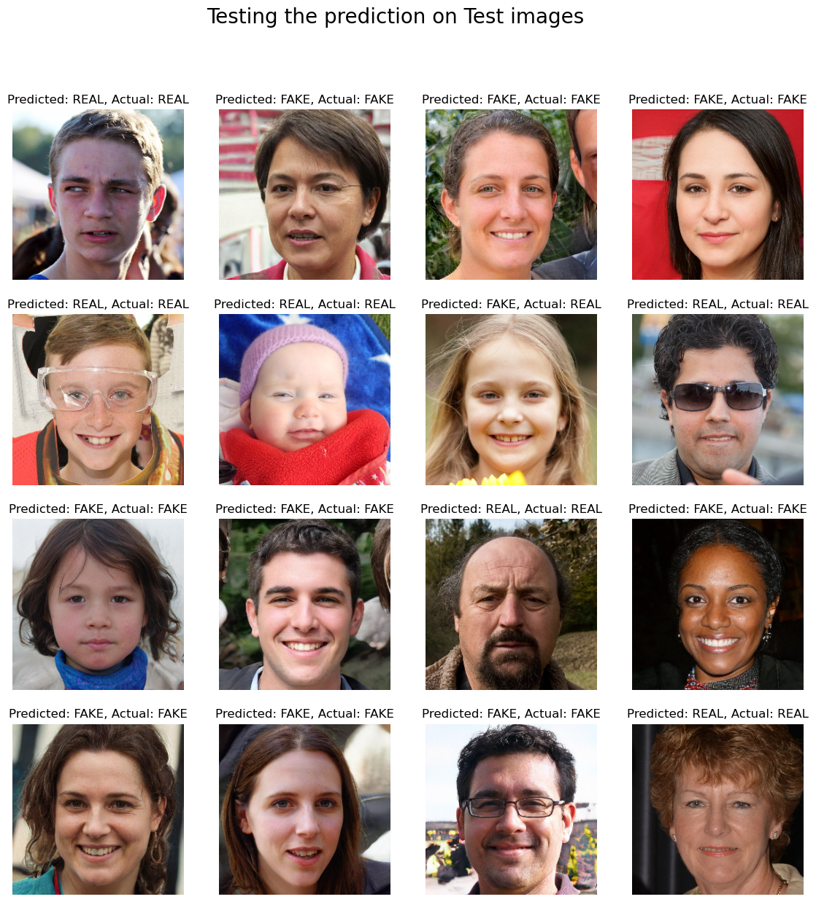

# Deep Fake Detection with Advanced CNN

This project creates a deep fake detection model using a **Convolutional Neural Network (CNN)** to identify **real** and **fake** faces. The model achieves **96% accuracy** on a dataset of **140,000** images, consisting of **70,000 real** faces and **70,000 fake** faces generated by StyleGAN.

Additionally, the repository features a real-time prediction system that allows the model to predict the authenticity of live photos, making it ideal for practical applications.

**Key Observations:** 
Performance metrics include **92% precision** for fake images, **99% precision** for real images, and **99% recall** for fake images with **92% recall** for real images. The F1-score is **95%** for both fake and real images. 

Additionally, the model achieved a **ROC-AUC** score of **0.9951** and an **AP** score of **0.995**, indicating excellent discrimination between real and fake faces.

When tested on 16 random images from testing set, the model successfully identified all of them with **100% accuracy**.

## Requirements

1. **Dataset:**
The dataset used here is from Kaggle:

   https://www.kaggle.com/datasets/xhlulu/140k-real-and-fake-faces

   It includes:-
70,000 real faces from the Flickr dataset collected by Nvidia &
70,000 fake faces generated by StyleGAN from the 1 Million Fake Faces dataset.

2. **Tools:** Python, Jupyter Notebook, TensorFlow, Keras, OpenCV.
3. **Libraries:** Pandas, NumPy, Matplotlib, Seaborn, Scikit-learn, ImageDataGenerator, StyleGAN.

## Conclusion
Given the growing prevalence of deep fake technology, this model can be an essential tool for identifying and preventing misinformation, fraud, and malicious content.

Also the code for this project can be accessd at main.ipynb

## Future Work

**Ensemble Model:** Plans to combine this CNN with other models (e.g., ResNet, EfficientNet) for enhanced performance via ensemble learning techniques.

## Acknowledgments
A huge shoutout and appreciation to [xsuryanshx](https://github.com/xsuryanshx/Detecting-GAN-Generated-DeepFake-Images), from where I took some references and code and tailored it according to my needs.
